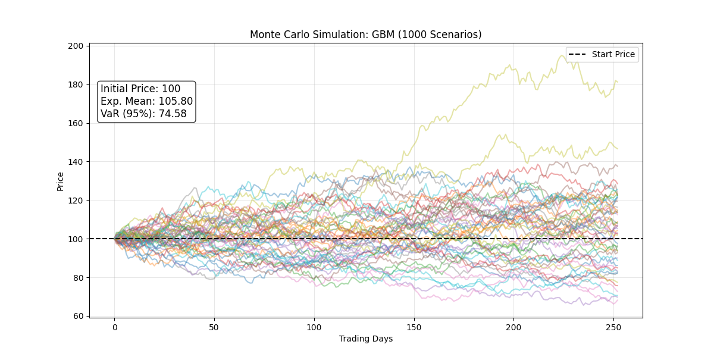

# Monte Carlo Asset Simulator

A quantitative finance tool designed to simulate future asset price paths using Stochastic Calculus. This project implements the Geometric Brownian Motion (GBM) model to generate thousands of potential market scenarios and calculates key risk metrics such as Value at Risk (VaR).

(Output: 1000 simulated price paths over 1 trading year with risk metrics)

## Project Overview
The script simulates the behavior of a financial asset assuming log-normal distribution of returns. It is widely used in derivatives pricing and risk management to assess tail risk.

## Mathematical Model: Geometric Brownian Motion
The simulation is based on the stochastic differential equation (SDE) for GBM:

$$dS_t = \mu S_t dt + \sigma S_t dW_t$$

Where:
* S_t is the asset price at time t.
* mu is the expected return (drift).
* sigma is the volatility.
* dW_t is a Wiener process (Brownian motion).

The discrete solution used in the Python loop is:

$$S_{t} = S_{t-1} \cdot e^{(\mu - 0.5\sigma^2)dt + \sigma\sqrt{dt}Z}$$

Where Z is a standard normal random variable N(0,1).

## Key Features
* Stochastic Simulation: Generates 1,000+ probabilistic price paths based on drift and volatility input.
* Risk Metrics Calculation: Automatically computes the Expected Mean Price and the 95% Value at Risk (VaR).
* Visualization: Plots the simulation paths and overlays the statistical results directly on the chart for immediate reporting.

## Technologies Used
* Python 3.10+
* NumPy: For vectorization and random number generation (Normal Distribution).
* Matplotlib: For visualizing the stochastic paths.

## How to Run
1. Install dependencies:
    pip install numpy matplotlib

2. Run the simulation:
    python monte_carlo_sim.py

3. The script will display the chart and save the output as monte_carlo_results.png.

---
Created by Notmvrc
